# Notes taken while following the course [Terraform Course on LinkedIn Formation](https://www.linkedin.com/learning/learning-terraform-2)

### Provider secret (AWS)

Register your credential in a secret file stored in `~/.aws/` 
* credentials file content :
     ```
     [default]
     aws_access_key_id=secret
     aws_secret_access_key=secret
    ```
## Deploying a resource (AWS S3 bucket) (`bucket/` folder)
### Terraform code 
`bucket.tf` where we specified the provider and resource configurations (aws and S3 bucket)

### Terraform commands 

`terraform init` To run in the terraform code directory, it initialize terraform and will look for any ```.tf``` file, analyze them and will download plugins.
 


`terraform apply` 


The bucket has been created :
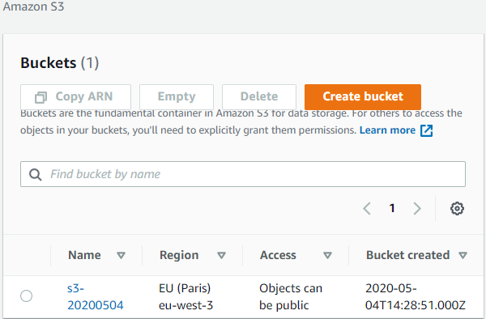

This is a very simple example. 


### How Terraform works 

In our example (deploying a resource), we might think why use terraform if we can do it with a script calling AWS API.

Terraform lets you define youre infrastructure as code, and gives a lot of flexibility in how you do that because you can freely use data from one resource to define another. In a non-Terraform script that just uses the API, you might deploy a couple of web servers and a load balancer. If you also want to add a new security group to function as a firewall, your script will need to call out to AWS, retrieve and process information describing those resources, and then take action to define your security group. With Terraform, that kind of sharing of data is trivial. Your code can define resources based on the definitions of other resources, even if they don't exist yet. That last point is critical. Terraform figures out the hard part of resource ordering and lets you just treat the infrastructure as static code.  

Terraform is taking the infrastructure described in your code and comparing it to the state of what actually exists, and then essentially writing a step by step script that will make the changes. The plan step is critical because it's the bit that figures out what needs to be done and in what order. Then, Terraform uses the provider to actually apply the plan and make whatever changes are needed.

Terraform uses a Directed Acyclic Graph where each node is a resource.


### Terraform commands

`terraform plan` Generates an execution plan for Terraform.

This execution plan can be reviewed prior to running apply to get a
sense for what Terraform will do. Optionally, the plan can be saved to
a Terraform plan file, and apply can take this plan file to execute

We deployed our resource an S3 bucket earlier, this is the output the plan command :
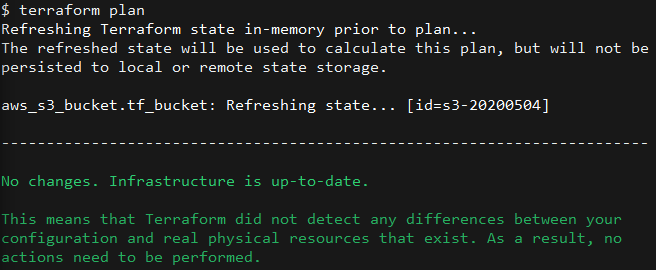

`terraform plan -destroy` 
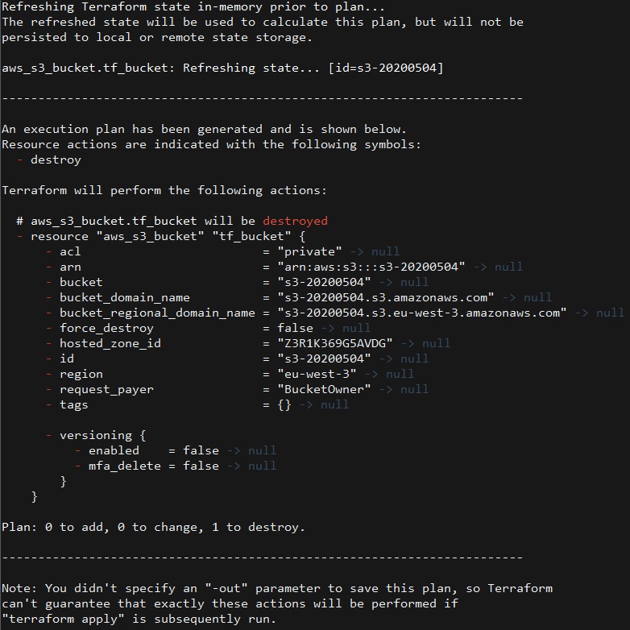

It indicates the state of the resource and the action that will be done 

> Here we didn't specify the -out the plan is generated but not saved. 


`terraform plan -destroy -out=name.plan`

Setting the *-out* parameter lets you separate plan and apply 


This will save the plan as a binary file `destroy.plan` 

To show it use :  `terraform show destroy.plan`

To apply the plan :
`terraform apply destroy.plan`


> If you use this plan it will go stale. That's why if you redeploy the bucket you will need to remake a plan for destroying the resource

## Terraform State


Refers to two differents things:
* The reality of your infrastructure. What is the state of the resouces on AWS ? Their IP addresses, their instance type, bucket name ... 
* The local representation that Terraform keeps a state file `.tfstate` which has a json format
  
>It's entirely possible for those two to be out of sync, and Terraform doesn't know until it refreshes its local state.

#### Local terraform state
`.tfstate` after destroying, changing the bucket name in `bucket.tf`and applying it :


#### Remote State Storage (using Terraform [Backend Feature](https://www.terraform.io/docs/backends/index.html))
Terraform state can be stored remotely, Remote storage is something you'd have to set up if you were working on a team using a feature Terraform call [Backends](https://www.terraform.io/docs/backends/index.html). 

Remote storage of state prevents a team from stomping on each other's changes and allows teams to do things like delegate and share resources. For example, you could allow some users read-only access to certain details of the infrastructure, but still let Terraform run as though it had full access, as long as it didn't change this. 

#### Terraform state command (preferred way of investigating at terraform state)

`terraform state`  

 ##### Altering state

Messing with the state and the state file is something to try to avoid at all cost. It is needed sometimes. Sometimes things can get just a little bit out of sync, and Terraform can't recover itself. But that is an advanced thing on a large infrastructure and messing with state shouldn't be done lightly.

##### Read Only subcommands
* `terraform state list` 
    
    List of types and names of resources provisioned :
    

* `terraform state list resourcename` 
  
  Dig in a little bit deeper on a specific resource :


`terraform show` see the entire state file 
`terraform show -json` will show a JSON representation of the state 


### Terraform graph command 


`terraform graph`


The syntax is known as DOT for DOT file (common way to defining graphs like this). To see it generate the graph visually, there is an open source webtool called : [WebGrpahViz](http://webgraphviz.com/)


This is the graph for our simple case of providing an S3 bucket.
Nodes can be run in parrallel. 
Diamonds shape are for providers.

## Creating a bucket, nginx instance, VPC,a SecurityGroup, Elastic IP (`prod/` folder)

`prod/` -> create our infra -> `prod.tf`
We have 3 resources a bucket, a nginx instance, a VPC, a security group.

`terraform init` (check for `.tf` file and download plugins)
`terraform plan` (showing the plan)
`terraform apply` creating our resource on AWS
`terraform plan -destroy -out=destroy.plan` to delete resources


`terraform plan` (showing the plan)
`terraform apply` creating our resource on AWS

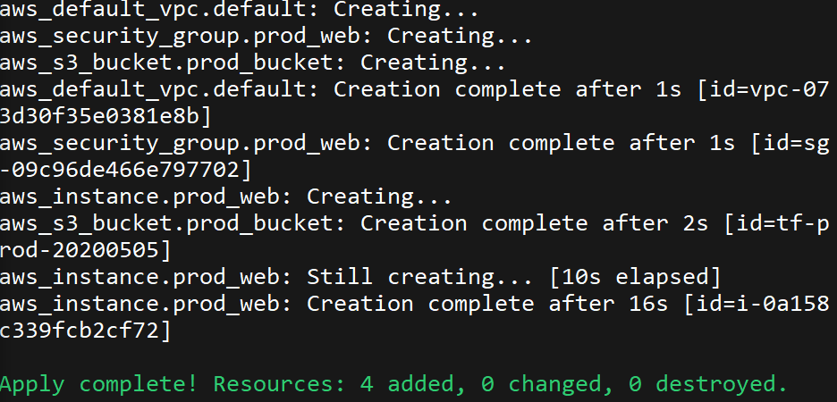

At this step we have our nginx instance running :

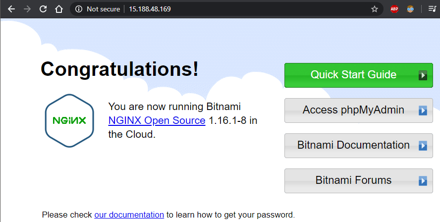

>The public IP set to the nginx instance is ephemeral, so if you spun this instance up again, it would most likely get a totally different IP.

A single IP would be nicer, in order to do that add the AWS EIP (elastic IP) a static IP that can be reassigned.

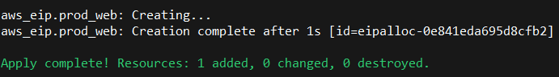

Once we set the static ip the ephemeral ip doesn't work : 

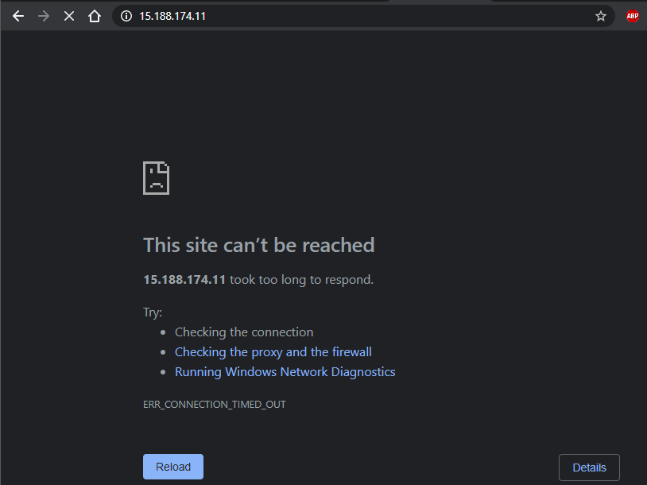

The static ip works : 


If the instance is destroyed and recreated the ip static ip will not change. 

But when we ran the plan to destroy the instance, it shows that 2 resource will be deleted : 

`terraform plan -destroy -target=aws_instance.prod_web -out=destroyInstance.plan`

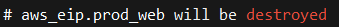
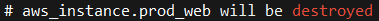
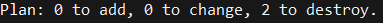

The elastic ip is assigned right inside the definition :

```
/*EIP*/
resource "aws_eip" "prod_web" {
  instance = aws_instance.prod_web.id
  
  tags = {
    "Terraform" = "true"
  }
}
```

The elastic ip depends on the instance as shown in the graph : `terraform graph | grep -v -e 'meta' -e 'close' -e 's3' -e 'vpc'` 

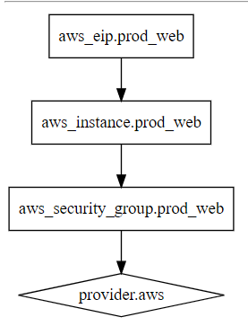

So the eip can't be created before the instance because it needs that instance data in order to be created.

That's why it need to be modified, for example if we want to scale.

```
/*
Decoupling the creation of the IP and it's assigment
*/
resource "aws_eip_association" "prod_web" {
  instance_id   = aws_instance.prod_web.id
  allocation_id = aws_eip.prod_web.id 
}

  

/*EIP*/
resource "aws_eip" "prod_web" {
  tags = {
    "Terraform" = "true"
  }
}
```

Decoupling the creation of the IP and it's assigment give this graph :


The eip provisoning is right after the provider, as the security group.

And at the end there is the eip associated. 

#### Scaling 

`count = 2` added to instance resource def

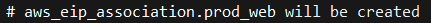
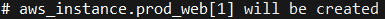
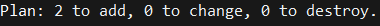

Applied :
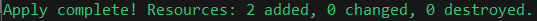


#### Loadbalancer 

Add subnet and Elb: 

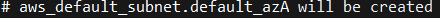
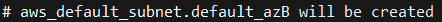
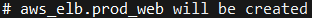
Applied :


#### Autoscaling group

Adding a template from https://www.terraform.io/docs/providers/aws/r/autoscaling_group.html and adapting it to our code.

after creating the vpc and subnets, creation of the elb and autoscaling group:

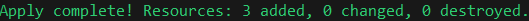
## Modules

After writing module run `terraform init`